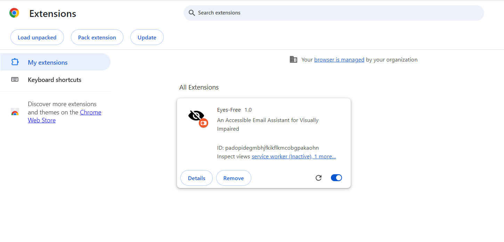
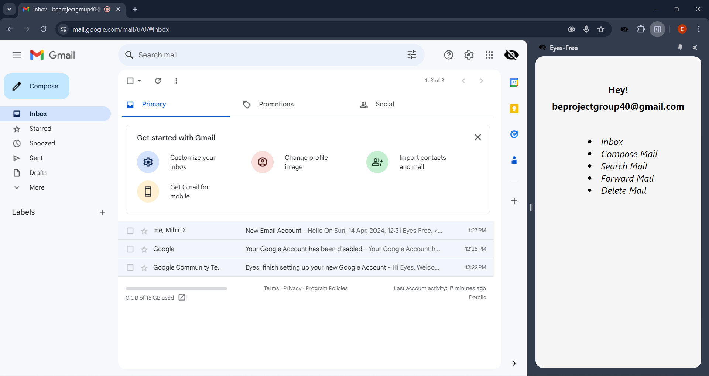

#  Eyes-Free

An Accessible email assistant for Visually Impaired.

A Chrome extension that enables voice command control for email operations, coupled with voice verification to ensure only authorized users can access their Gmail accounts.


## Features

- Register user with Voice Biometrics
- Read Emails
- Forward Emails
- Compose and Send an Email
- Search Emails


## Installation / Usage

To use this extension clone the repository locally using ```$ git clone https://github.com/ms070902/eyes__free.git``` or download the zip file of repository.

Install [Chrome Extension CLI](https://github.com/dutiyesh/chrome-extension-cli) using following command:

```bash
  $ npm install -g chrome-extension-cli
```
To build the project use following command:
```bash
  $ npm run watch
```  
It will create a build folder in your working directory.

```Go to Chrome -> Manage Extension -> Enable Developer Mode -> Load unpacked -> select/path/of/build/folder```

The extension is now ready to be used on any gmail tab. Press spacebar key to start extension.

Make sure to keep server running for chrome extension to communicate with backend.

To keep server running, clone repository ```https://github.com/AneeshShamraj/beprojbackend```

Follow below steps to run backend.

Step1: Install all libraries:
```bash
  $ pip install SpeechRecognition fastapi speechbrain "uvicorn[standard]"

```
These are the functions performed by the libraries:
1.	SpeechRecognition: This is a Python library for performing speech recognition, with support for several engines and APIs, both online and offline. It allows you to convert audio data into text transcripts.
2.	FastAPI: FastAPI is a modern, fast (high-performance), web framework for building APIs with Python. It is based on standard Python type hints and is designed to be easy to use and learn, while providing high performance and excellent development experience.
3.	SpeechBrain: SpeechBrain is a PyTorch-based speech toolkit for speech processing tasks, including speech recognition, speaker recognition, multi-microphone signal enhancement, and more. It provides state-of-the-art models and recipes for various speech-related tasks.
4.	uvicorn[standard]: Uvicorn is an Asynchronous Server Gateway Interface (ASGI) server for Python. It is used to serve and run FastAPI applications. The [standard] part refers to an optional dependency group that includes additional features and performance optimizations for Uvicorn.

Step 2: Download ngrok:

Click [here](https://ngrok.com/download) to download ngrok.
We download ngrok zip file through this website and then install it in the local machine. Ngrok is a tool that creates a secure tunnel between a local machine and the internet. It provides a public URL that can be used to access a web server or service running on your local machine from anywhere on the internet.

Step 3: Start server
```bash
  $ uvicorn main:app –reload
```
We use this command to start the server. Now this server can accept HTTP requests and send response.

Step 4: Host server on ngrok:
```bash
  $ ngrok http http://127.0.0.1:8000
```
We use ngrok to host the server.


You can also use following commands inorder to build zip folder to be uploaded to [Chrome Web Store](https://chrome.google.com/webstore/devconsole/).

```bash
    ///Packs the build folder into a zip file under release folder.
    $ npm run pack

    ///Rebuilds and packs the app into a zip file. 
    ///It is a shorthand for npm run build && npm run pack.
    $ npm run repack
```
## Demo

[Click here for video Demo](https://drive.google.com/file/d/1zr5pC-X_TISNTI7tlu4hh1sRucDroO-X/view?usp=sharing)





## Authors

- [Mihir Shah](https://www.github.com/ms070902)
- [Aneesh Shamraj](https://github.com/AneeshShamraj)
- [Bhoomi Shetty](https://github.com/bhoomihz)
- [Rohit Sonejee](https://github.com/Killerrohit007)
